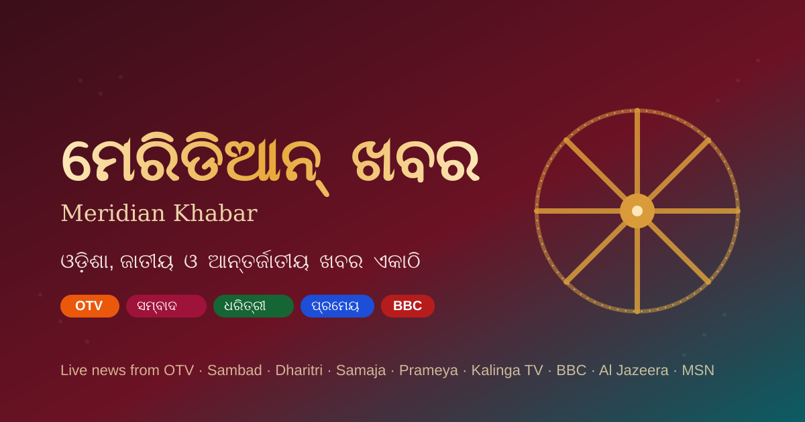

# ମେରିଡିଆନ୍ ଖବର — Meridian Khabar

A live Odia news aggregator — Odisha, national, and international headlines
in one place, pulled directly from publisher RSS feeds and rendered
server-side. Built with TanStack Start, deployed on Cloudflare Workers via
[Lovable](https://lovable.dev).

**Live app:** [newsapps.lovable.app](https://newsapps.lovable.app)



## What it does

Every page load fetches fresh headlines server-side from each publisher's
own RSS feed — no static content, no scraping the homepage, no third-party
news API. Articles link straight back to the original publisher; this app
only shows a headline, a short excerpt, and a photo.

**Sources**

| Group | Publishers |
|---|---|
| ଓଡ଼ିଶା (Odisha) | OTV, Sambad, Dharitri, Samaja, Prameya, Kalinga TV |
| ଜାତୀୟ (National) | Times of India, Hindustan Times, Indian Express |
| ଆନ୍ତର୍ଜାତୀୟ (International) | BBC, Al Jazeera, MSN / Bing News |

## Why this exists (and the jugad behind it)

Indian regional news publishers rarely document a stable RSS URL, and their
feeds are inconsistent about including images, so most of this codebase is
about resilience:

- **Feed URL probing** — each source lists a few candidate RSS paths; the
  first one that returns real `<item>` entries wins and gets cached for the
  rest of that server instance's life. If a publisher moves their feed, the
  app just falls through to the next candidate instead of breaking.
- **Image extraction** handles every shape publishers actually use:
  `media:content`, `media:thumbnail`, `<enclosure>`, and — the most common
  case for WordPress-based sites — an `` buried in `content:encoded`
  with no dedicated image field at all.
- **Image backfill**, for feeds that genuinely omit images entirely: tries
  the site's `wp-json/wp/v2/posts` REST API first (for confirmed WordPress
  sources — a plain JSON endpoint, less often blocked than the HTML page),
  then scrapes the article's own `og:image` meta tag (same trick every
  publisher already relies on for WhatsApp/Facebook link previews), then
  falls back to [microlink.io](https://microlink.io)'s headless-browser
  link-preview API as a last resort for pages behind JS-based bot
  protection.
- **Image proxy** — every image is routed through
  [wsrv.nl](https://wsrv.nl) (a free image cache/proxy), sized to a fixed
  slot (lead vs. grid card) and re-compressed to WebP. This sidesteps
  hotlink-protection and mixed-content blocks, and keeps "big image, tiny
  card" inconsistency from happening. Feed-native images try loading
  directly first (usually already sized sanely by the publisher's own CDN);
  backfilled images always go through the proxy, since their origin size is
  unpredictable.
- **Copyright-respecting by design** — no full article text is ever stored
  or displayed, only the publisher's own short RSS summary, capped at
  ~260 characters.

## Tech stack

- [TanStack Start](https://tanstack.com/start) (React 19, file-based
  routing, server functions, SSR)
- [Tailwind CSS v4](https://tailwindcss.com) + [shadcn/ui](https://ui.shadcn.com)
  component primitives
- [fast-xml-parser](https://github.com/NaturalIntelligence/fast-xml-parser)
  for RSS parsing
- Deployed to Cloudflare Workers, built via [Lovable](https://lovable.dev)

## Project structure

```
src/
  data/sources.ts        Source registry: candidate feed URLs, accent
                          colors, group, CMS hints (wordpress: true, etc.)
  lib/
    rss.server.ts         Feed fetching, parsing, image extraction/backfill
    image-proxy.ts        Shared wsrv.nl sizing helper (lead vs. grid slots)
    time-ago.ts            Odia-language relative timestamps
  server-fns/news.ts       TanStack Start server function wrapping rss.server
  components/
    site-chrome.tsx         Header (source tabs) + footer
    news-card.tsx            Article card (lead + grid variants)
  routes/
    __root.tsx                Document shell, meta/favicon/OG tags, map backdrop
    index.tsx                  Home page — fetches + renders the feed
public/
  favicon.svg / .ico          Konark Sun Temple wheel motif
  og-image.png                 Social share image (1200×630)
  map-bg.svg                    Decorative world/India dot-map background
```

## Design

The theme draws on Odisha's own visual language rather than a generic news
template:

- **Palette** — Jagannath-temple sindoor maroon as primary, temple gold as
  secondary, Chilika-lake/Bay-of-Bengal teal as accent, with a warm cream
  page background instead of stark white.
- **Favicon & wordmark** — a Konark Sun Temple wheel motif, which also
  happens to be the same chakra on India's national flag.
- **Background** — a faint, self-generated dot-map of the world with India
  and an Odisha marker picked out, sitting behind all content at ~6-10%
  opacity. Purely decorative, `aria-hidden`.
- **Rainbow accent** — a thin gradient stripe (maroon → saffron → gold →
  forest-green → teal → violet) under the header and above the footer, and
  a matching gradient applied to the masthead text.

## Local development

```bash
npm install
npm run dev
```

Requires Node.js. The dev server runs the same TanStack Start SSR pipeline
used in production, so RSS fetching works locally too (subject to your own
network's access to each publisher's domain).

## Known limitations

- Publisher RSS paths aren't documented anywhere official — the candidate
  URLs in `src/data/sources.ts` are best-effort and may need updating if a
  publisher changes their feed setup. The app degrades gracefully (shows
  "unavailable" for that source) rather than breaking if a feed moves.
- The `microlink.io` fallback is rate-limited on its free tier; under heavy
  traffic it may stop returning images for the handful of articles that
  need it, well before every other extraction method has been exhausted.
- MSN/Bing News' `format=rss` parameter has shown some inconsistency in
  testing — it's wired up with multiple candidate URLs, but hasn't been
  fully confirmed to resolve reliably from every environment.
